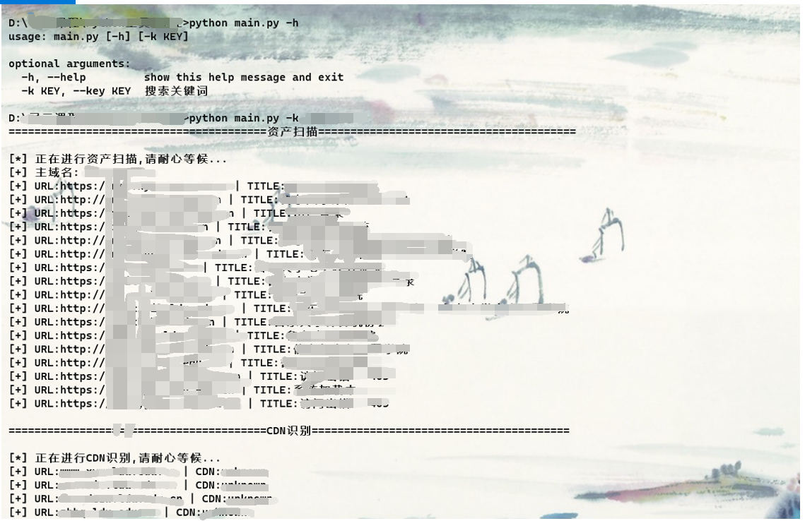
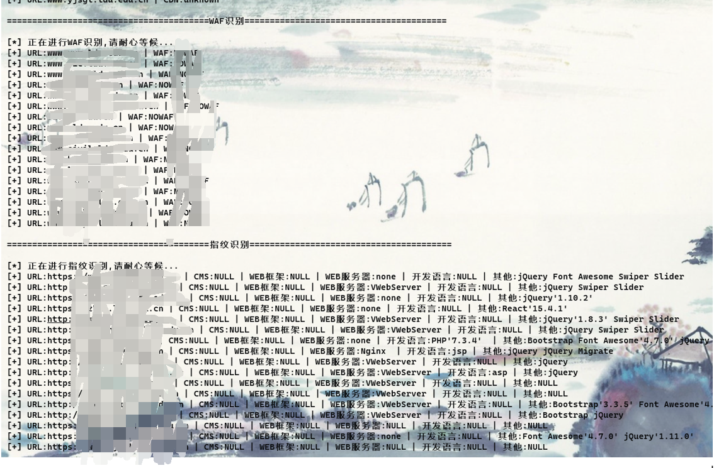
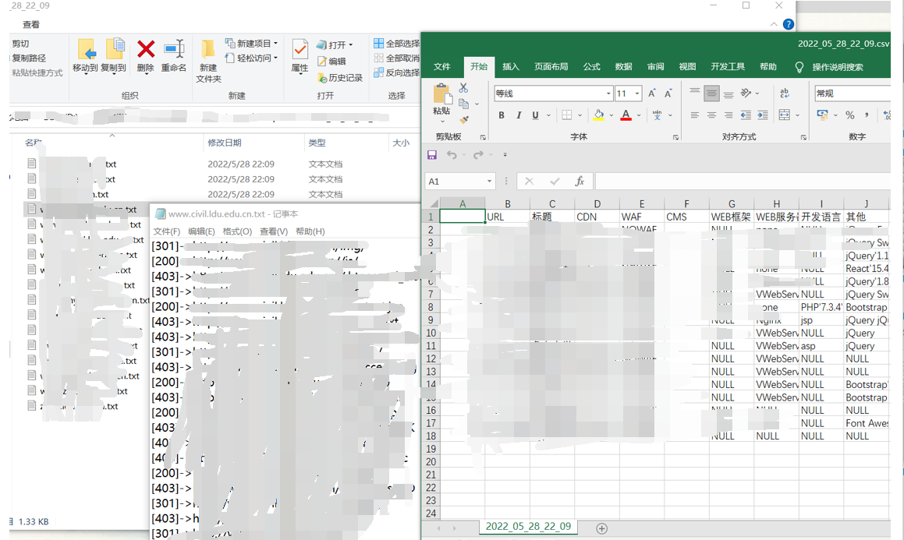

# Python信息收集工具
**输入系统名称，自动搜集相关资产信息**

### **此工具为寻云公益培训作业**
###               **讲师：阿浪**
---
### 编写思路

- crawler --资产信息爬取
  > 首先输入系统名称
  > 1. 若为xx公司、xx大学等，则调用天眼查和百度搜索，提取主域名，再通过主域名调用百度、谷歌、fofa、360quake搜索资产
  > 2. 若为xx建站系统，则调用fofa，360quake搜索资产
- assethandle --资产处理
  > 去重+存活验证+HTTP站点识别+获取标题
- portscan --端口扫描
  > 通过socket库，扫描存活的tcp端口
- cdnident --CDN识别
  > 爬取www.cdnplanet.com,cdn.chinaz.com两个网站的识别结果
- wafw00f --WAF识别
  > 调用wafw00f进行WAF识别
- fingerident --指纹识别(CMS、开发语言、WEB框架、WEB服务器)
  > 调用Wappalyzer和Whatcms
- pathscan --目录扫描
  > 调用dirscsan进行目录扫描
- apikey.yaml --key配置
- main.py --主程序

---
### 运行效果






---
### 功能
- [x] 资产扫描
- [x] CDN识别
- [x] WAF识别
- [x] 指纹识别
- [x] 目录扫描
- [x] 端口扫描

---
### 使用

**扫描结果会自动保存在result文件夹下**
```
D:\信息搜集工具>python main.py -h
usage: main.py [-h] [-k KEY]

optional arguments:
  -h, --help         show this help message and exit
  -k KEY, --key KEY  搜索关键词
  
  
eg: python main.py -k xx大学 
    
    python main.py -k xx公司

```

---
### 配置

```
@ apikey.yaml

360Quake:
  X-QuakeToken : 
  Content-Type : 
Fofa:
  email : 
  key : 
```
